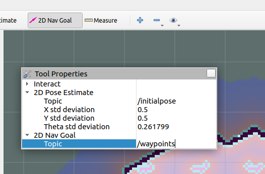

# Waypoint Following Node

## Introduction
This is a waypoint following node that utilises move base to send your robot on a series of waypoints.

## Installation
```
cd <workspace path>/src
git clone https://github.com/lkw303/waypoint_follower.git
cd <workspace path>
source ~/opt/ros/noetic/setup.bash
catkin_make
```

## Running

### Checks
In order to run the node there are a series of things to have the node run properly:
1. make sure the active move base server's name corresponds with `move_base_server_name` in the launch file
2. ensure the the topic of `geometry_msgs::PoseStamped` publish corresponds with `waypoints_topic` in the launch file.
3. ensure that the move base action server for the robot of interest is up and running.


### Launching
after you have done the checks you can run
```
cd <workspace path>
source ~/opt/ros/noetic/setup.bash
source <workspace path>/devel/setup.bash
roslaunch waypoint_follower waypoint_follower.launch
```

### Usage
The waypoint following node subscribes to the `waypoint_topic` specified in the launch file and sends the robot on a series of waypoints after it has collected a number of waypoints being published. This number can be specified in the launch file as the parameter `max_waypoints`. The default for this number is 5.

For ease of usage we will be using current rviz tools to aid us in publishing the waypoints. Of course you are free to publish it mannually or using another node as well!

First we change the rviz publish topic of the 2D NavGoal to correspond with `waypoint_topic` which we defined in the launch file. In this case we set it to "waypoints".


And now we are good to go. Simply using the Rviz 2D Nav Goal tool to set the waypoints and once `max_waypoints` number of waypoints are populated. The node will start sending the robot on it journey!

## Example Deployment
The video below shows an example deployment of the `waypoint_follower` node turtlebot3 in the turtlebot3 world in gazebo.


